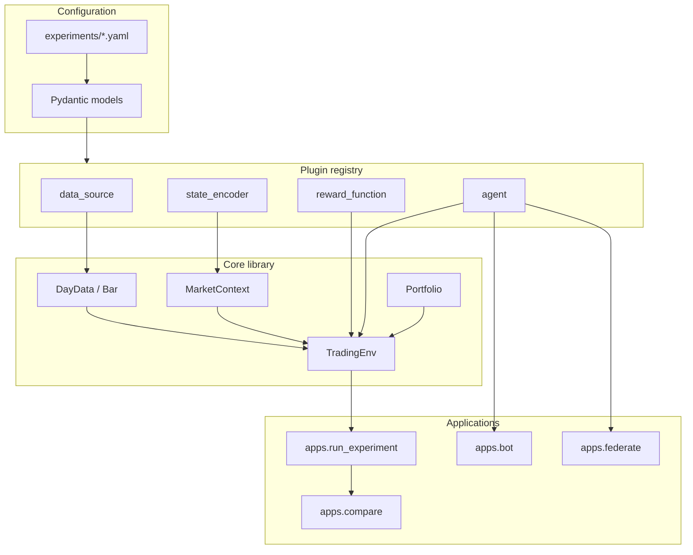

# Architecture

The codebase has a shared research and production core. Experiments and live trading differ mainly in the entry point and data source.

## System Design



## Main Responsibilities

| Area | Responsibility |
|---|---|
| `config.py` | Load YAML, resolve inheritance, validate config |
| `registry.py` | Register and build data/state/reward/agent plugins |
| `data/` | Normalize external files into timezone-aware bars |
| `state/` | Convert market context into discrete state indices |
| `reward/` | Compute reward from portfolio value changes |
| `agent/` | Choose actions, update Q-tables, save/load artifacts |
| `portfolio/` | Enforce fee, cash, shares, and lot-size accounting |
| `env/` | Simulate one trading day with decision points |
| `diagnostics/` | Explain coverage, signals, oracle, and reports |
| `api_client/` | Thin Quantphemes REST wrappers |

## Lab Track

The lab track is YAML-first:

```text
experiments/*.yaml -> apps.run_experiment -> results/<run>/
```

New hypotheses usually require only a new YAML file. Python changes are reserved for new plugin types or new diagnostics.

## Production Track

The production track loads one selected artifact:

```text
experiments/production_2800.yaml + artifacts/q_state.pkl -> apps.bot -> Quantphemes
```

The live bot does not train. It only builds the encoder and agent from config, loads the trained Q-table, computes target quantity, and patches broker holdings when not in dry-run mode.

## Safety Invariants

- Fees apply only when the position changes.
- `V_t` is measured before the action; fees live in `V_{t+1}`.
- Q-table ties are random, never default cash.
- Live broker writes happen only when `--dry-run` is omitted.
- Secrets live in `.env`, not in Git.
