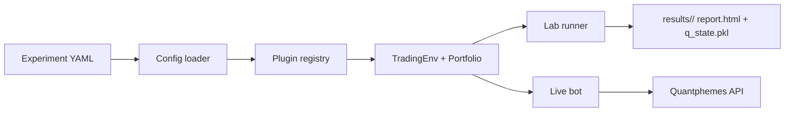

# Quantphemes RL Knowledge Base

Quantphemes RL is a Q-learning research and live-trading workflow for Hong Kong ETFs. The production path trades `2800.HK` through the Quantphemes broker API, while the lab path lets us test assets, intervals, state encoders, reward functions, and agents through YAML configuration.

This documentation is written for a mixed audience: someone should be able to understand the project goal in a few minutes, then keep reading into the engineering and operational details when needed.

## What The Project Solves

The project gives us one shared system for three jobs:

- **Research:** run reproducible experiments over historical ETF data.
- **Diagnostics:** explain whether a model failed because the policy is bad, the features are weak, or transaction costs dominate.
- **Production:** deploy the selected Q-table to a live paper-trading strategy with explicit safety checks.

## Two Tracks, One Core

The same core abstractions drive both offline experiments and live execution. Lab experiments produce `q_state.pkl`; production loads that artifact and calls `Agent.act(..., training=False)`.

## Current Status

| Area | Status |
|---|---|
| Data adapters | CSV, Futu CSV, Bloomberg XLSX |
| Learning core | Q-table agent, baseline agents, plugin registry |
| Diagnostics | Coverage, oracle, signal checks, HTML report |
| Experiment runner | YAML-driven walk-forward training |
| Live bot | Azure/systemd-ready, dry-run and live modes |
| Federation | Visit-weighted Q-table merge |

## Where To Go Next

-   **New user**

    Start with [Getting Started](getting-started/index.md), then read [Architecture](architecture/index.md).

-   **Running experiments**

    Use [Experiment Workflow](experiments/index.md) and [Data Guide](data/index.md).

-   **Operating the bot**

    Follow the [Live Trading Runbook](operations/runbook.md) before touching live mode.

-   **Extending the system**

    Read the [Developer Guide](developer/index.md) for plugin and testing rules.

