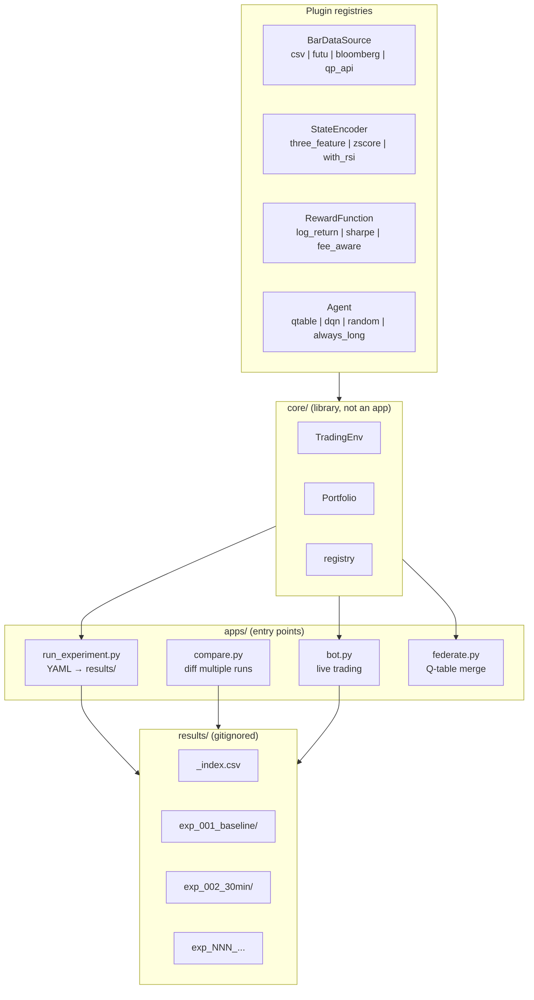

# Quantphemes RL Project — Development Plan v2

> Revision of v1 with a lab-style experimentation workflow grafted on.
> Driven by: lightweight tracking, full plugin architecture (state,
> reward, agent), local laptop, 40 bps round-trip fee retained.

---

## 0. What changed from v1

| | v1 | v2 |
|---|---|---|
| Goal | One production bot | One production bot + a lab for hypothesis testing |
| State encoder | Hardcoded 3-feature | Plugin (`@register` decorator); baseline is the 3-feature spec |
| Reward function | Hardcoded log-return | Plugin; baseline is log-return |
| Agent | Q-table only | Plugin; Q-table now, DQN/PPO later |
| Data source | One CSV loader | Adapter interface; CSV, Futu, Bloomberg, Quantphemes API all plug in |
| Experiment workflow | None | YAML config → one command → reproducible `results/` folder |
| Fee assumption | 20 bps one-side (per spec) | **Unchanged — 20 bps one-side = 40 bps round-trip retained** |

Everything in v1 §1 (consolidated spec) and §2 (why current model
loses money) carries over. The phase plan is restructured below.

---

## 1. Architecture: Lab + Production, Shared Core



### The two tracks

**Production track** is a single, stable experiment:
`experiments/production_2800.yaml`. Same code path as any lab
experiment, just deployed to the live bot instead of evaluated offline.

**Lab track** is everything else under `experiments/`. New hypothesis =
new YAML file. No code changes for things like:

- Different asset (2828, 7299, anything in your data)
- Different interval (5-min, 30-min, 1-hour, EOD)
- Different bin thresholds
- Different state features (once the encoder plugin exists)
- Different reward shape
- Different agent (once DQN plugin exists)

You only write Python when adding a *new plugin* (e.g. an RSI-based
state encoder). After it exists, you reuse it via YAML.

---

## 2. Directory Layout

```
quantphemes_rl/
├── README.md
├── pyproject.toml
├── SPEC.md                          # canonical spec (replaces email chain)
│
├── src/quantphemes_rl/              # importable library
│   ├── __init__.py
│   ├── registry.py                  # @register("name") decorator + lookup
│   ├── config.py                    # YAML loader + validator
│   │
│   ├── data/
│   │   ├── base.py                  # BarDataSource ABC
│   │   ├── csv_source.py
│   │   ├── futu_source.py
│   │   ├── bloomberg_source.py
│   │   └── api_source.py            # Quantphemes live (read-only)
│   │
│   ├── state/
│   │   ├── base.py                  # StateEncoder ABC
│   │   └── three_feature.py         # baseline
│   │
│   ├── reward/
│   │   ├── base.py                  # RewardFunction ABC
│   │   └── log_return.py            # baseline
│   │
│   ├── agent/
│   │   ├── base.py                  # Agent ABC: act / update / save / load
│   │   ├── qtable.py                # baseline
│   │   └── baselines.py             # random, always_long, buy_and_hold
│   │
│   ├── env/
│   │   └── trading_env.py           # Gym-like, plugin-agnostic
│   │
│   ├── portfolio/
│   │   └── portfolio.py
│   │
│   ├── diagnostics/
│   │   ├── coverage.py              # state visit counts
│   │   ├── oracle.py                # ex-post optimal policy
│   │   ├── signal.py                # mutual info, feature/return scatter
│   │   └── report.py                # bundles everything into report.html
│   │
│   └── api_client/
│       └── quantphemes.py           # thin REST wrapper, no business logic
│
├── apps/                            # entry points (small)
│   ├── run_experiment.py
│   ├── compare.py
│   ├── bot.py
│   └── federate.py
│
├── experiments/                     # one YAML per hypothesis
│   ├── _baseline.yaml               # the canonical spec, used as defaults
│   ├── production_2800.yaml         # → live bot
│   ├── exp_001_baseline.yaml
│   ├── exp_002_30min.yaml
│   ├── exp_003_5min.yaml
│   ├── exp_004_2828.yaml
│   ├── exp_005_leveraged_2x.yaml
│   ├── exp_006_leveraged_3x.yaml
│   └── README.md
│
├── data/raw/                        # gitignored: CSVs, Futu exports, BBG xlsx
│
├── results/                         # gitignored: one folder per run
│   ├── _index.csv                   # auto-appended: one row per run
│   ├── exp_001_baseline_20260512_143002/
│   │   ├── config.snapshot.yaml
│   │   ├── git_commit.txt
│   │   ├── metrics.json
│   │   ├── train_log.csv
│   │   ├── q_state.pkl
│   │   ├── report.html
│   │   └── plots/*.png
│   └── …
│
├── tests/
│   ├── test_state.py
│   ├── test_portfolio.py
│   ├── test_env.py
│   ├── test_qtable.py
│   ├── test_registry.py
│   └── fixtures/
│       └── synthetic_5days.csv
│
└── notebooks/                       # ad-hoc analysis only, not training
```

Why `src/quantphemes_rl/` and not a flat layout: experiments under
`experiments/` and apps under `apps/` should import as
`from quantphemes_rl.state import three_feature`, never as
`from ..state import three_feature`. The src-layout enforces this and
makes pip-installing the package straightforward.

---

## 3. The Plugin Registry — concrete shape

`src/quantphemes_rl/registry.py` is tiny but central:

```python
# pseudo-code, ~30 lines
_REGISTRIES: dict[str, dict[str, type]] = {}

def register(kind: str, name: str):
    """@register('state_encoder', 'three_feature')"""
    def decorator(cls):
        _REGISTRIES.setdefault(kind, {})[name] = cls
        return cls
    return decorator

def build(kind: str, name: str, **kwargs):
    return _REGISTRIES[kind][name](**kwargs)
```

Then each plugin file does:

```python
from quantphemes_rl.registry import register
from quantphemes_rl.state.base import StateEncoder

@register("state_encoder", "three_feature")
class ThreeFeatureEncoder(StateEncoder):
    def __init__(self, thresholds: dict): ...
    def encode(self, ctx: MarketContext) -> int: ...
    @property
    def num_states(self) -> int: return 27
```

The four abstract bases — `BarDataSource`, `StateEncoder`,
`RewardFunction`, `Agent` — are each ~20 lines of `abc.ABC`. Concrete
classes are slim too. The whole registry mechanism is under 100 LoC.

**Why this beats configuration-only:** when you write a new state
encoder using RSI, you put it in
`src/quantphemes_rl/state/with_rsi.py`, decorate it
`@register("state_encoder", "with_rsi")`, and *every* experiment YAML
can now write `state: { encoder: with_rsi, ... }`. No `if/elif` chains
in the training script.

**Why this stays "light":** no Hydra, no plugin discovery via setuptools
entry points. Just `import quantphemes_rl` at the top of
`run_experiment.py` and all decorators fire. Adding a plugin is one
file + one import line.

---

## 4. Example YAML — a working experiment

```yaml
# experiments/exp_005_leveraged_2x_1h.yaml
name: exp_005_leveraged_2x_1h
description: |
  Hypothesis: 2x leveraged HSI ETF (7299.HK) has 2x intraday range,
  so a higher fraction of 1-hour moves exceed the 40 bps round-trip
  fee threshold. Use baseline 3-feature encoder so the only variable
  is the asset.
seed: 42

inherits: _baseline.yaml          # everything below overrides _baseline

data:
  source: csv
  path: data/raw/7299_HK_1h.csv
  symbol: "7299.HK"
  start: "2020-01-01"
  end: "2025-12-31"

market:
  fee_bps_one_side: 20            # 40 bps round-trip retained
  capital: 1000000
  decision_times: ["10:30", "11:30", "13:30", "14:30", "15:30"]
  force_close_time: "15:55"

state:
  encoder: three_feature
  thresholds:
    delta_close: [-0.015, 0.015]  # widened from baseline since 2x asset moves more
    delta_open:  [-0.010, 0.010]
    delta_prev:  [-0.008, 0.008]

reward:
  function: log_return

agent:
  type: qtable
  epsilon_start: 0.4
  epsilon_decay_per_episode: 0.98
  epsilon_min: 0.01
  alpha_mode: per_cell             # or "one_over_d" to match spec exactly
  optimistic_init: 0.0
  tie_break: random                # NOT "cash" — fix from v1 §2

training:
  walk_forward:
    initial_train_days: 1000
    test_window_days: 250
  episodes_per_window: 100

evaluation:
  baselines:                       # run these alongside for comparison
    - random_binary
    - always_long
    - buy_and_hold
  compute_oracle: true             # ex-post optimal binary policy
  feature_signal_check: true       # mutual info per feature
```

The `inherits` key keeps experiment YAMLs short. The base
`_baseline.yaml` holds the canonical spec values (the ones from §1 of
v1). Each experiment YAML only writes the deltas.

---

## 5. Hypothesis Backlog (prioritised)

Designed so each experiment is one YAML and answers one question. Order
matters: the early experiments establish bounds; later ones explore.

### Tier 1 — Bounds (run first, cheap, high information value)

These don't even need a trained model. Run them once to know what
"good" looks like.

| Exp | Hypothesis | Expected outcome |
|---|---|---|
| `random_binary` | A coin-flip policy with the same fees | A floor: any model worse than this is actively harmful |
| `always_long` | Day-trade flat→long every morning, flat at close | Tells you the daily-flatten cost on a generic asset |
| `buy_and_hold` | Buy day 0, hold to last day, fees only at boundaries | The classic benchmark |
| `oracle` | Ex-post optimal binary policy with perfect foresight | The ceiling — the maximum any binary-action model could ever earn |

If `oracle − buy_and_hold` net of fees is small or negative, **no
agent on this asset/interval can profitably trade.** That's a Mark
conversation, not a code conversation.

### Tier 2 — The asset/interval grid (the heart of the lab)

One YAML per cell. Run with the baseline Q-table agent.

| | 2800.HK | 2828.HK | 7299.HK (2x) | 7568.HK (3x*) |
|---|---|---|---|---|
| 5-min | exp_002 | | | |
| 30-min | exp_003 | | | |
| **1-hour (spec)** | **exp_001 baseline** | exp_004 | exp_005 | exp_006 |
| EOD (1 decision/day) | exp_007 | | | |

`*` confirm 7568.HK is in your tradeable universe; substitute another
3x candidate if not. Lab can test it even if production can't trade it.

What you're testing: **does the fee-to-volatility ratio improve enough
in any cell to make the policy profitable?** From v1's analysis, only
17.5% of 30-min 2800.HK moves clear 40 bps. A 3x leveraged equivalent
should push that fraction toward ~50%, which is where signal-finding
becomes feasible.

### Tier 3 — Signal engineering (run after Tier 2 picks an asset)

Hold the asset/interval at the best of Tier 2; vary state and reward.

| Exp | What changes | Why |
|---|---|---|
| `exp_010_zscore_bins` | Bin thresholds = rolling z-score, not fixed % | Bin "big move" relative to current volatility regime — answers your team's `roll_20d` intuition properly |
| `exp_011_rsi_feature` | Add RSI as 4th feature (3×3×3×3 = 81 states) | Most common momentum signal; cheap to test |
| `exp_012_overnight_gap` | Add overnight-gap as a 4th feature | Captures gap-fill behaviour, well-documented anomaly |
| `exp_013_fee_aware_reward` | Reward subtracts a small fixed "churn cost" beyond the fee | Discourages flipping in/out without conviction |
| `exp_014_sharpe_adjusted` | Reward = log-return / rolling vol | Encourages risk-adjusted decisions |

Each Tier 3 experiment is *only worth running* if Tier 2 found a
combination where the Q-learning policy at least matches `always_long`
net of fees. Without that, you're tuning a sinking ship.

### Tier 4 — Algorithmic upgrades (later)

| Exp | What changes |
|---|---|
| `exp_020_dqn` | Replace Q-table with a small MLP; use continuous features |
| `exp_021_ppo` | Replace value-based agent with actor-critic; supports fractional actions |
| `exp_022_action_widening` | Re-introduce `{0, 0.5, 1}` action space (needs Mark's OK) |

DQN on a laptop CPU is feasible at this scale (a 5-input 2-output MLP
trains in seconds). Don't go here until Tier 2/3 have produced at least
one configuration that beats `always_long` net of fees.

### Tier 5 — Production preparation

| Exp | What changes |
|---|---|
| `production_2800` | Whatever beat the bounds in Tiers 2–4, but on 2800.HK with spec parameters | The thing the live bot reads |

---

## 6. Phase Plan v2

Compared to v1: phases 0–2 unchanged (data + env + portfolio); phase 3
adds the registry; phase 4 is a new "experiment runner"; phase 5–6
re-ordered.

Estimated times assume 1 dev, full-time-ish; halve them if you're
working 4 hours/day.

### Phase 0 — Skeleton (½ day)

Same as v1 Phase 0, plus:
- `experiments/_baseline.yaml` with the §1 spec values from v1
- `experiments/README.md` explaining the YAML schema
- `results/` in `.gitignore`

**Done when:** `pip install -e .` and `pytest -q` both succeed.

### Phase 1 — Data layer (1–2 days)

- `BarDataSource` ABC with one method: `load(symbol, start, end,
  interval) -> list[Bar]`.
- `csv_source.py` first (works against the data you already have).
- `futu_source.py` and `bloomberg_source.py` are thin adapters that
  call the existing CSV loader under the hood — i.e., they read your
  Futu exports and Bloomberg Excel into a normalised `Bar` list. No
  live Futu/BBG API calls.
- `api_source.py` for Quantphemes is read-only price endpoints, used
  by the live bot. Documented endpoints first; undocumented endpoints
  in a `_undocumented.py` with a comment.

**Done when:** `pytest tests/test_data.py` green; you can swap CSV ↔
Futu in a YAML without touching code.

### Phase 2 — Portfolio + Env (1 day)

Same as v1 Phase 2. The env is now plugin-agnostic — it takes a
`StateEncoder` and `RewardFunction` as constructor args.

**Done when:** Three deterministic scenarios (all-cash, all-long-uptrend,
alternating) match closed-form expectations in tests.

### Phase 3 — Registry + baseline plugins (1–2 days)

- `registry.py` (~30 LoC).
- `StateEncoder` ABC + `ThreeFeatureEncoder` plugin.
- `RewardFunction` ABC + `LogReturnReward` plugin.
- `Agent` ABC + `QTableAgent` plugin + three baseline agents
  (`RandomBinary`, `AlwaysLong`, `BuyAndHold`).
- Tests for each.

`Agent` ABC has 4 methods: `act(state, training) → action`,
`update(transition)`, `save(path)`, `load(path)`. That's it.

**Done when:** Each plugin works in isolation; an empty YAML referencing
all four by name resolves to a callable training loop (even if it
trains on toy data).

### Phase 4 — Experiment runner + result folder layout (1 day)

`apps/run_experiment.py`:

```bash
python -m apps.run_experiment experiments/exp_001_baseline.yaml
```

Does:
1. Loads YAML, resolves `inherits`, validates with a schema (`pydantic`).
2. Sets random seeds.
3. Instantiates `BarDataSource`, `StateEncoder`, `RewardFunction`,
   `Agent` from the registry.
4. Splits walk-forward windows.
5. Runs training, saving per-episode metrics.
6. Runs evaluation (and runs every baseline named in
   `evaluation.baselines`).
7. Writes `results/<name>_<timestamp>/` with:
   - `config.snapshot.yaml` (full resolved config)
   - `git_commit.txt`
   - `metrics.json` (all numerical results)
   - `train_log.csv`, `eval_log.csv`
   - `q_state.pkl` (if agent supports it)
   - `report.html` (Phase 5 deliverable)
   - `plots/*.png`
8. Appends one row to `results/_index.csv`.

**Done when:** `python -m apps.run_experiment experiments/_baseline.yaml`
completes and produces a results folder with every artifact above.

### Phase 5 — Diagnostics & report (1–2 days)

This is the most important content phase — without it the lab is
flying blind.

`src/quantphemes_rl/diagnostics/`:
- `coverage.py` — per-decision-point cell visit counts.
- `oracle.py` — ex-post optimal binary policy NAV.
- `signal.py` — mutual information between each state feature and the
  next-interval return; bin-conditional return histograms.
- `report.py` — generates `report.html` with: NAV curves, action
  distribution by decision point, coverage heatmap, oracle ceiling,
  feature-signal diagnostics, summary stats vs every baseline.

**Done when:** Running Phase 4 on `_baseline.yaml` produces an HTML
report containing all of the above.

### Phase 6 — Tier 1 + Tier 2 sweep (2–3 days)

Now use the lab. Run all Tier 1 experiments + the asset/interval grid.
This is where most calendar time goes — not coding, but running and
interpreting.

**Done when:** You can answer "does the spec (1h, 2800, 3-feature)
clear the bounds, or does some other cell of the grid clear them?" with
data, not opinion.

`apps/compare.py results/exp_001/ results/exp_004/ results/exp_005/`
produces a side-by-side table. Useful for the Mark meeting.

### Phase 7 — Live bot (2 days)

Same as v1 Phase 6. Now `bot.py` reads
`experiments/production_2800.yaml` and uses the same plugin objects as
the lab. No divergence between train and run.

The bot's three jobs (all small functions):
1. Sync runtime state with broker (current_qty, cash).
2. On each decision point: fetch price → state → agent.act() → PATCH.
3. Log everything.

**Done when:** `python -m apps.bot --config experiments/production_2800.yaml
--dry-run` runs through a simulated trading day end-to-end and logs
one structured line per decision.

### Phase 8 — Federated merge (1 day)

Same as v1 Phase 7. Visit-count-weighted average. Refuse incompatible
shapes.

### Phase 9 — Tier 3+ as needed (open-ended)

Add plugins that Phase 6 motivated. Iterate.

---

## 7. Minimum-Viable vs Stretch

If your timeline is tight:

| | Minimum (2 weeks) | Stretch (4 weeks) |
|---|---|---|
| Phase 0 | ✓ | ✓ |
| Phase 1 | CSV + Quantphemes only | + Futu + Bloomberg adapters |
| Phase 2 | ✓ | ✓ |
| Phase 3 | Q-table + 3 baselines only | + room for DQN agent class (not implemented) |
| Phase 4 | ✓ | ✓ |
| Phase 5 | Bounds + coverage only | + signal/MI/oracle |
| Phase 6 | Tier 1 + 3 cells of Tier 2 | Full Tier 2 grid + Tier 3 signal eng. |
| Phase 7 | ✓ | ✓ |
| Phase 8 | Stub only (file format defined) | Working merge with mock partner |

Either way, the **interfaces are the same** — minimum is just fewer
plugins under each base class. You can ship Tier 3 plugins later
without restructuring.

---

## 8. Specific questions still worth resolving

Before Claude Code starts on Phase 0:

1. **Confirm Quantphemes tradeable universe.** If `7299` or any
   leveraged ETF is supported, production can eventually use lab
   findings. If not, lab outputs are advisory only.
2. **Confirm Futu data granularity.** If it's 1-minute bars, lab can
   test 5/15/30/60-min by aggregation. If it's tick data, we need a
   bar-builder.
3. **Confirm fee model the backend actually charges.** Spec says 20
   bps one-side. Mark's reference code uses HK retail fees with HKD
   50 commission floor (which on 1M HKD notional rounds to ~0.005%
   commission floor — irrelevant). Confirm what the backend bills so
   the env matches reality.
4. **Confirm timeline.** If you have <2 weeks, drop Tier 3 from scope
   and just bring Tier 1+2 data to the meeting.

Answer these in your next message and I can produce the actual Phase 0
scaffolding — `pyproject.toml`, base classes, `_baseline.yaml`, the
registry, and a stub `run_experiment.py` — so Claude Code has a
concrete starting point.

---

*End of plan v2.*
